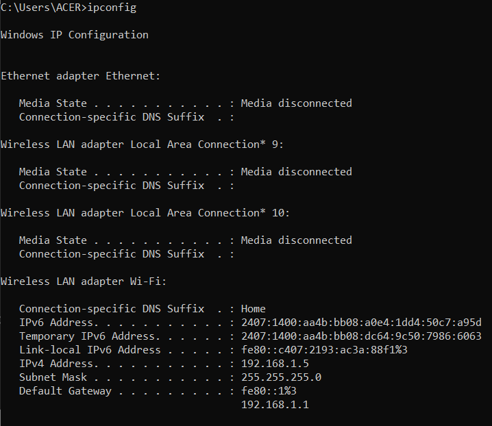

## Tasks
    1. Capture your network configuration using the "ipconfig" command in your command prompt.
    2. What is your network address?
    3. What is your subnet mask?
    4. Given the subnet mask and network address, how many nodes can your network support?

## 1. Capture your network configuration using the "ipconfig" command in your command prompt.

### IP Address:

    IPv6 Address. . . . . . . . . . . : 2407:1400:aa4b:bb08:a0e4:1dd4:50c7:a95d
    Temporary IPv6 Address. . . . . . : 2407:1400:aa4b:bb08:dc64:9c50:7986:6063
    Link-local IPv6 Address . . . . . : fe80::c407:2193:ac3a:88f1%3
    IPv4 Address. . . . . . . . . . . : 192.168.1.5

## 2. What is your network address?

The network address is determined by performing a bitwise AND operation between the IPv4 address and the subnet mask.

    IPv4 Address: 192.168.1.5
    Subnet Mask: 255.255.255.0

Since the subnet mask is 255.255.255.0, this means that the first three octets (192.168.1) represent the network address, and the last octet (5) is the host identifier.

    Network Address: 192.168.1.0

## 3. What is your subnet mask?

The subnet mask in the configuration is:

    255.255.255.0

## 4. Given the subnet mask and network address, how many nodes can your network support?

The subnet mask of 255.255.255.0 indicates that the last octet is used for host addresses. This is a /24 network (since 255.255.255.0 has 24 bits set to 1).

The formula to calculate the number of hosts in a subnet is:

$2^{(\text{No of Host Bits})} - 2$

Here, there are 8 host bits (since the subnet mask leaves 8 bits for hosts):

$2^{(\text{8})} - 2 = 254$

Hence, the number of nodes supported is:

    254

