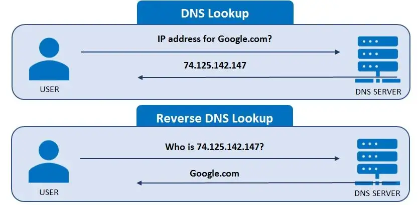

## Task:
```
1. What happens when you type google.com on the browser and press enter? Write a report.
```
## 1. What happens when you type google.com on the browser and press enter?
When you type "google.com" into your browser and press Enter, a complex series of events occurs behind the scenes to load the Google homepage. Here's a step-by-step breakdown of the process:
1. **URL Parsing**:

    The browser begins by parsing the URL "google.com" to understand the protocol (HTTP/HTTPS), the domain name (google.com), and potentially any path or query string. This parsing helps the browser determine how to handle the request and what steps to follow next.

2. **DNS Lookup**:

    

    The browser needs to find the IP address associated with "google.com." It sends a DNS query to resolve the domain name into an IP address.

    Steps Involved:
   
    - Checks if the IP address is cached from a previous visit.
    - If not found in the browser, it checks the OS-level DNS cache.
    - If still unresolved, the request moves to the router's cache.
    - If the router doesn't have the address, it queries the ISP's DNS server.
    - If the ISP's server doesn't have the address, it begins a recursive search through the root DNS servers, TLD (Top-Level Domain) servers (.com), and authoritative DNS servers until it finds the IP address for "google.com."

4. **TCP/IP Connection**:

5. **SSL/TLS Handshake (if HTTPS)**:

6. **HTTP Request**:

7. **Server Processing**:

8. **HTTP Response**:

9. **Rendering the Page**:

10. **Resource Loading**:

11. **Final Page Display**:
