## Tasks:
```
1. Design a system for assigning IP address automatically to host on a network.
2. Simulate a DNS Server and Web Server in packet server.
3. Simulate DHCP on packet tracer. Have at least two different network.
```
## 1. Design a system for assigning IP address automatically to host on a network.

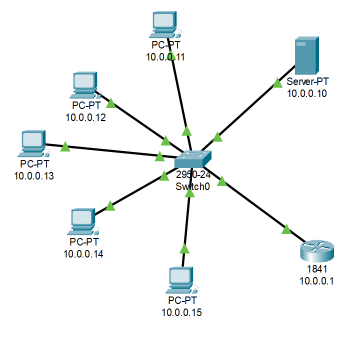

DHCP settings:

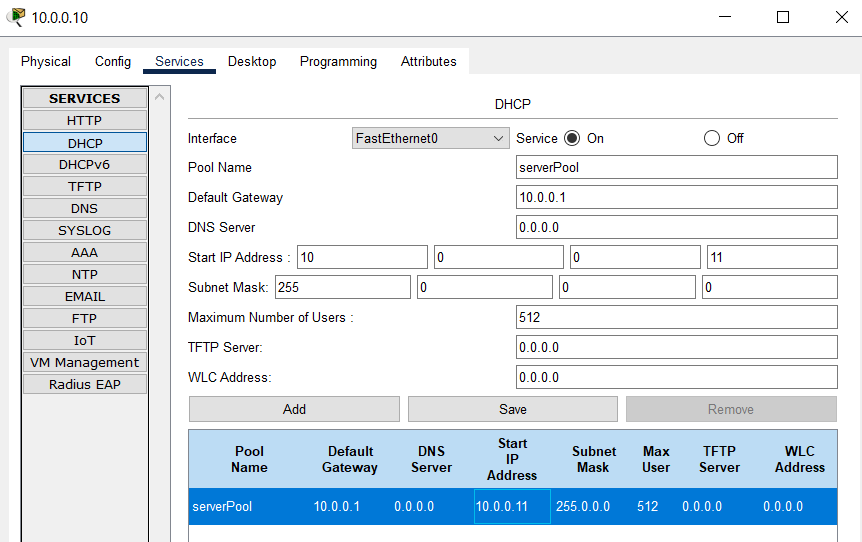

Automatic IP address setting:

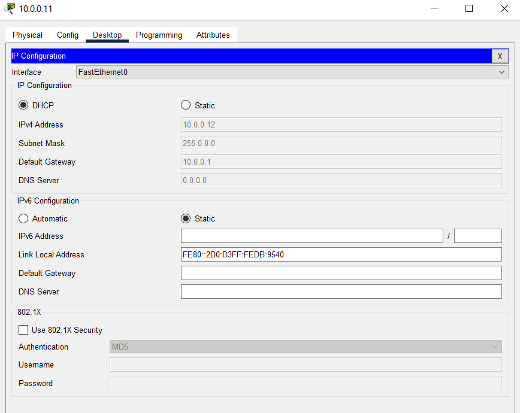

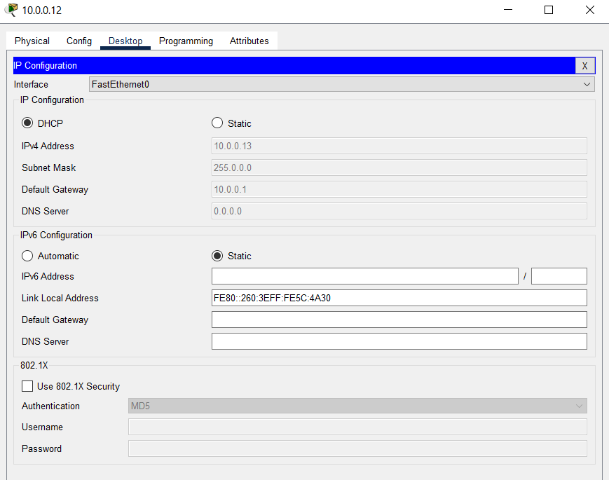

and so on...

## 2. Simulate a DNS Server and Web Server in packet server.

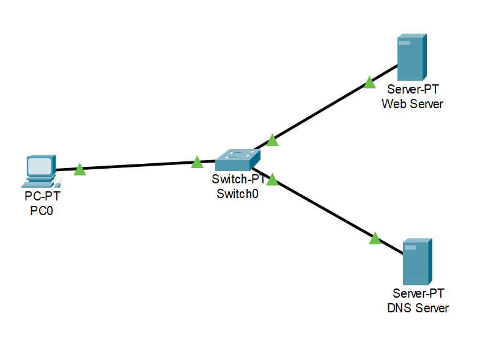

Web Server Settings:

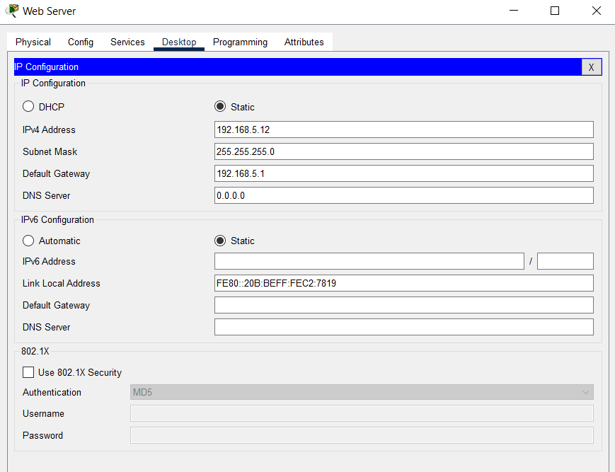

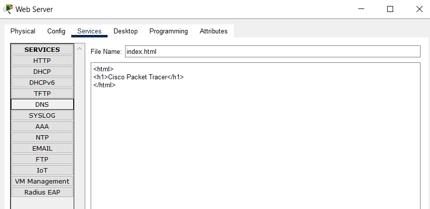

DNS Server Settings:

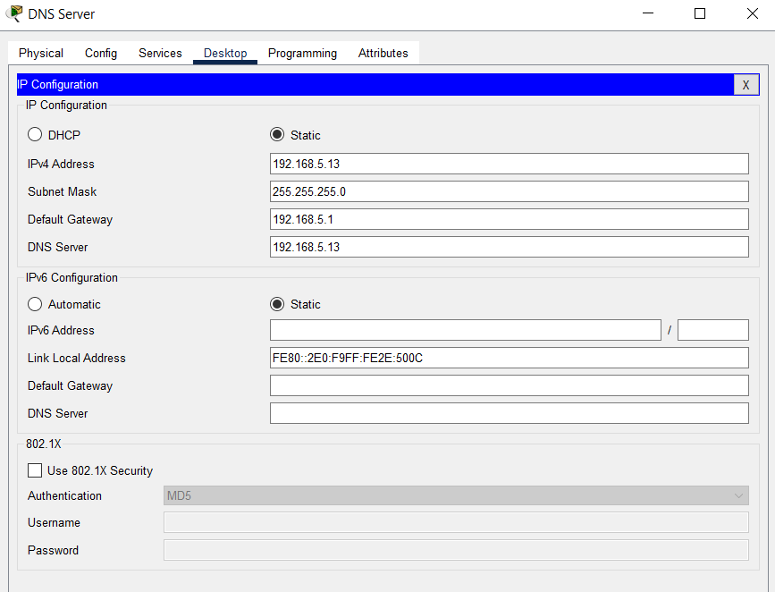


PC settings:

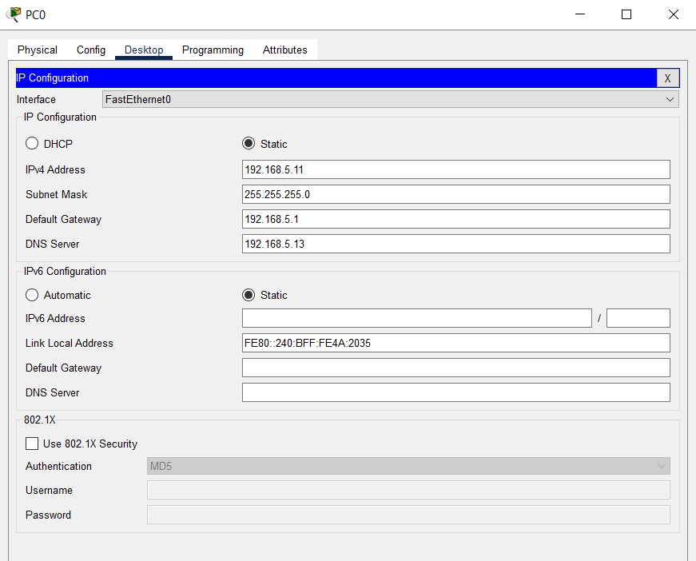

Web Browser:

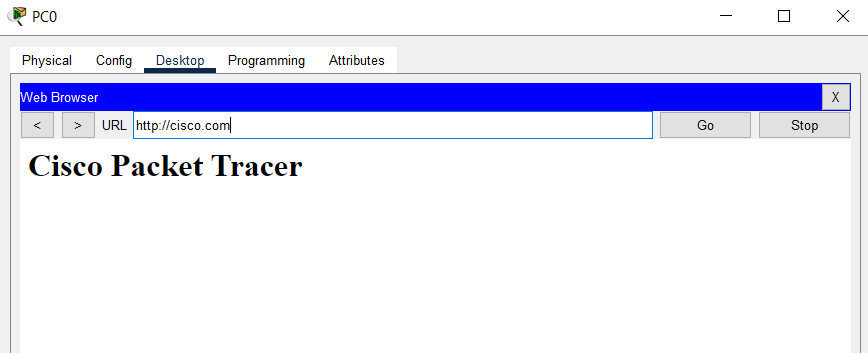

## 3. Simulate DHCP on packet tracer. Have at least two different network.

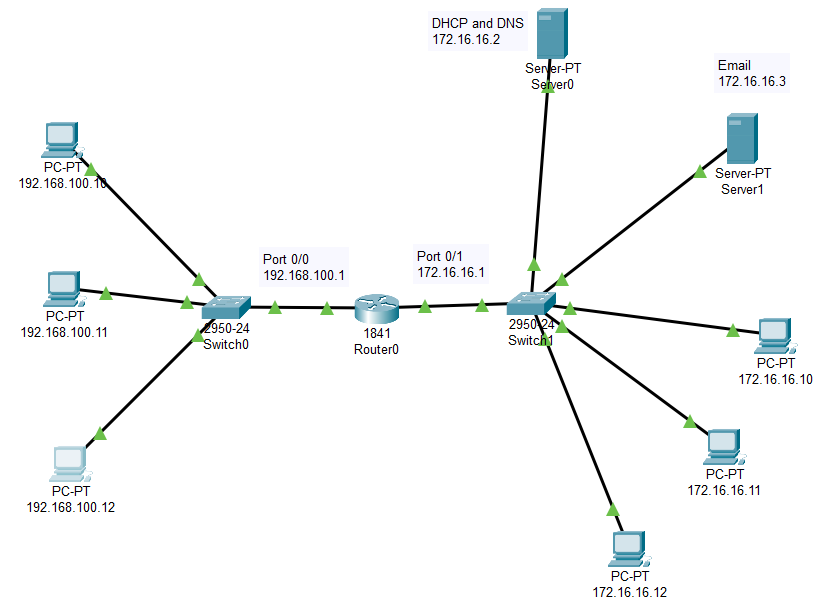

Server Settings:

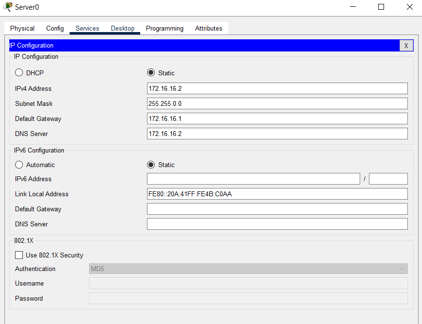

DHCP Settings:

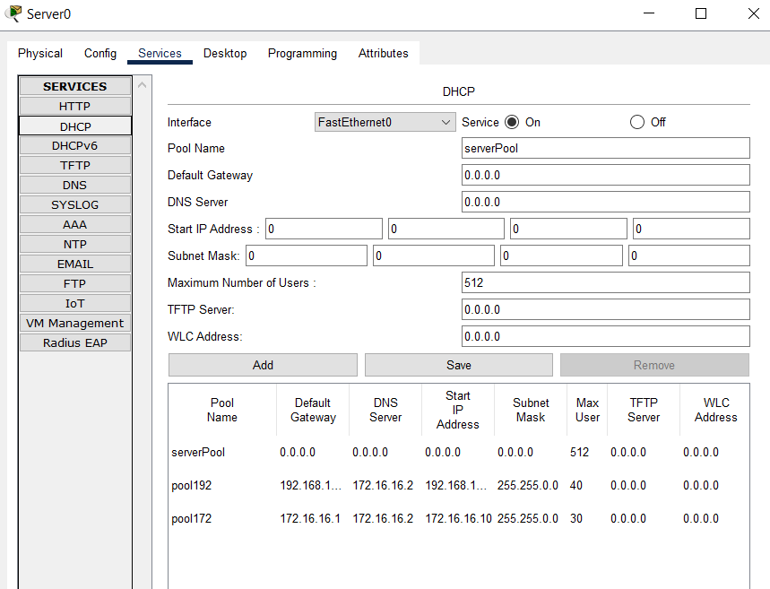

CLI Settings:

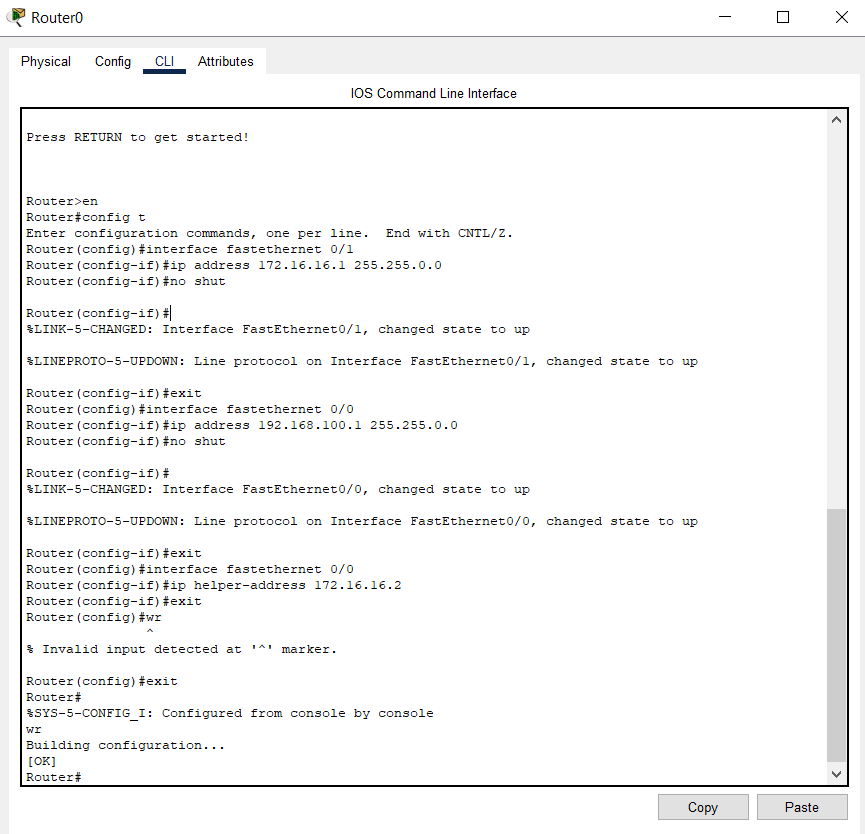

PC IP address setting:

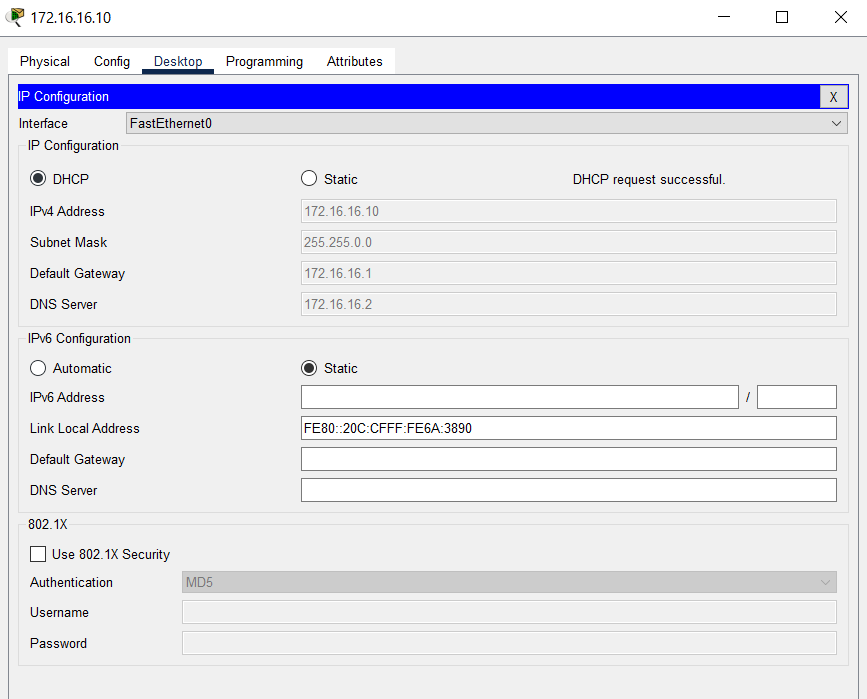
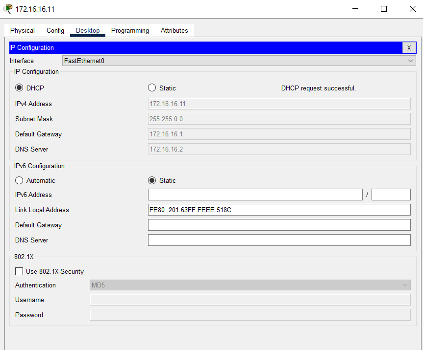
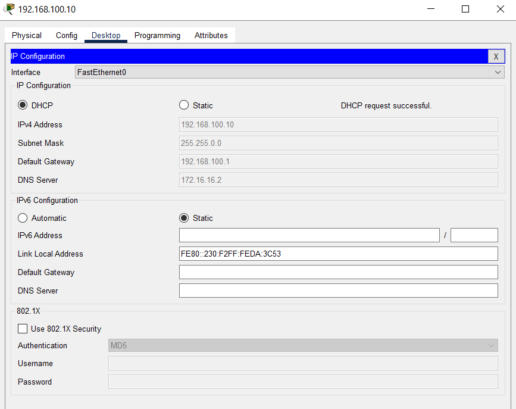
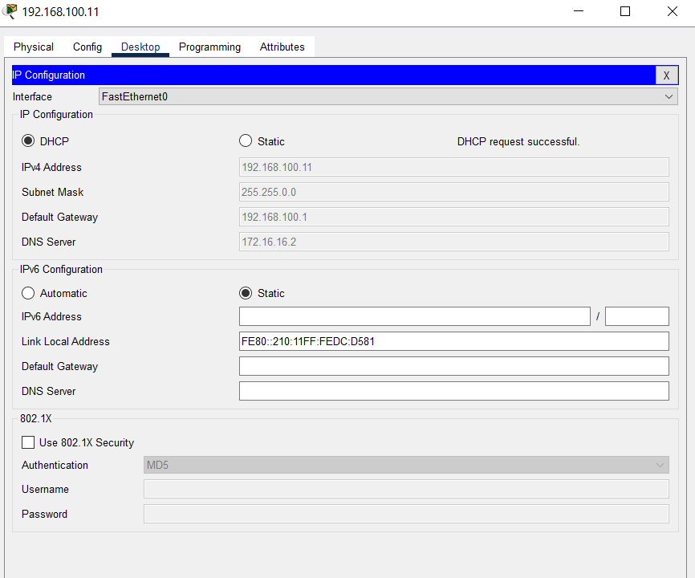