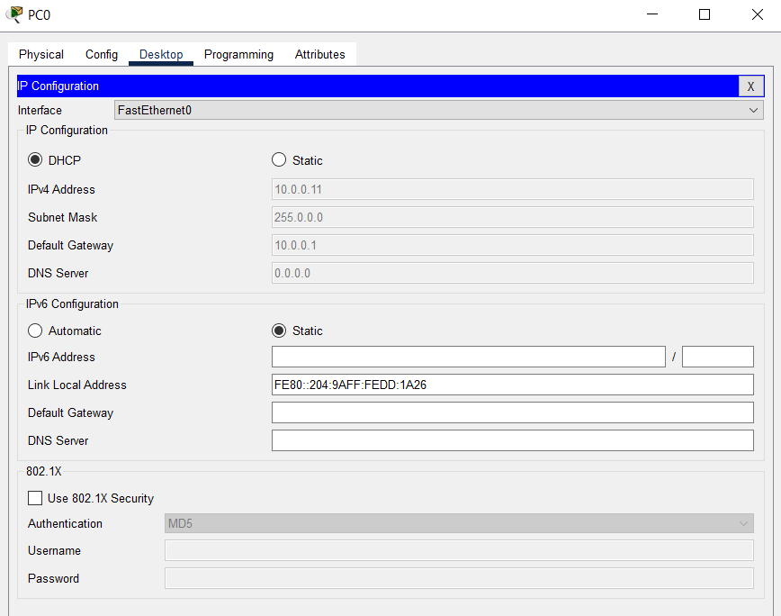
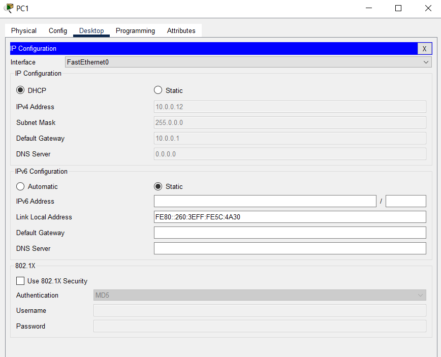

## Tasks:
```
1. Design a system for assigning IP address automatically to host on a network.
2. Simulate a DNS Server and Web Server in packet server.
3. Simulate DHCP on packet tracer. Have at least two different network.
```
## 1. Design a system for assigning IP address automatically to host on a network.


DHCP settings:


Automatic IP address setting:





and so on...

## 2. Simulate a DNS Server and Web Server in packet server.


Web Server Settings:


DNS Server Settings:


PC settings:


Web Browser:


## 3. Simulate DHCP on packet tracer. Have at least two different network.


Server Settings:


DHCP Settings:


CLI Settings:


PC IP address setting:


