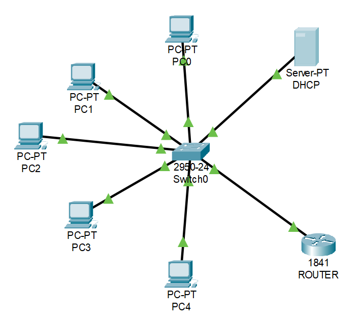
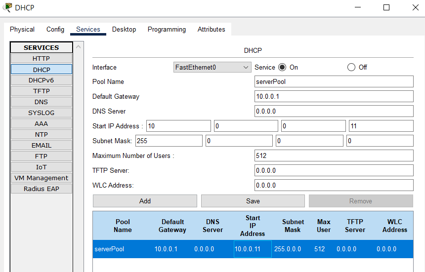

## Tasks:
```
1. Design a system for assigning IP address automatically to host on a network.
2. Simulate a DNS Server and Web Server in packet server.
3. Simulate DHCP on packet tracer. Have at least two different network.
```
## 1. Design a system for assigning IP address automatically to host on a network.



DHCP settings:



Automatic IP address setting:


and so on...

<<<<<<< HEAD
## 2. Simulate a DNS Server and Web Server in packet server.
=======
## 2. 32 bits were not enough as IP address for host. Design a system to connect more than $2^{32}$ host on the network (NAT).
>>>>>>> 5904d8732ffc1d03d7948a690335c4436c0aa7e6


Web Server Settings:


DNS Server Settings:


PC settings:


Web Browser:


## 3. Simulate DHCP on packet tracer. Have at least two different network.
