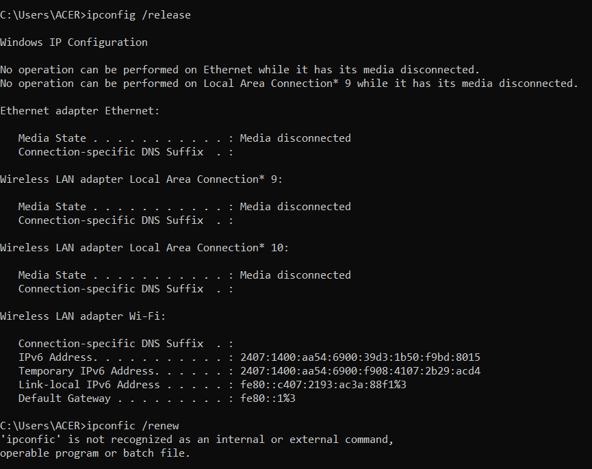
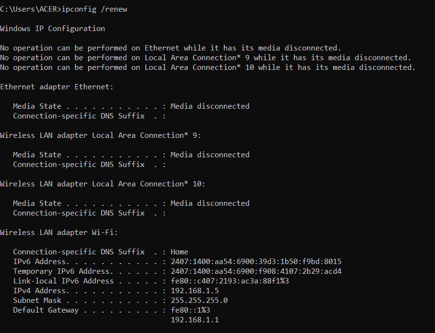
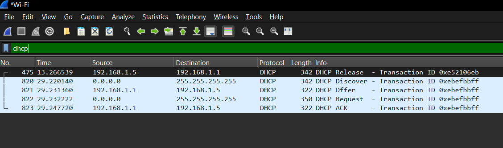

## Tasks:
```
1. Use Wireshark to demonstrate different packets involved in getting IP address from a DHCP server.
2. In the preferred language of your choice, write a web application that allows you to upload a file of minimum 10 MB size. Capture the upload in Wireshark. In your Wireshark capture, follow the TCP stream to inspect connection initiation, file transfer and connection termination.
3. Filter a Wireshark capture on IPV6 and explain why its field has the value it does?
```

## 1. Use Wireshark to demonstrate different packets involved in getting IP address from a DHCP server.

1. Start capturing packets with Wireshark.
2. Open the command prompt and release the IP Address with the command:
    ```
    ipconfig /release
    ```
3. Request a new IP Address with the command:
    ```
    ipconfig /renew
    ```
4. Now stop capturing packets in Wireshark.
5. Filter out the DHCP packets.







Here's a brief explaination of each of the DHCP packets discovered:

1. **DHCP**: The client releases its current IP address back to the DHCP server. This can happen when a client shuts down or manually releases the IP address.
2. **DHCP Discover**: The client broadcasts a discover message to locate any available DHCP servers on the network.
3. **DHCP Offer**: The DHCP server responds to the discover message with an offer that includes an available IP address and other network configuration details.
4. **DHCP Request**: The client responds to the server's offer by requesting the offered IP address. The broadcast ensures that all servers know which offer was accepted.
5. **DHCP Acknowledgement**: The DHCP server confirms that the client can use the requested IP address, completing the DHCP lease process.