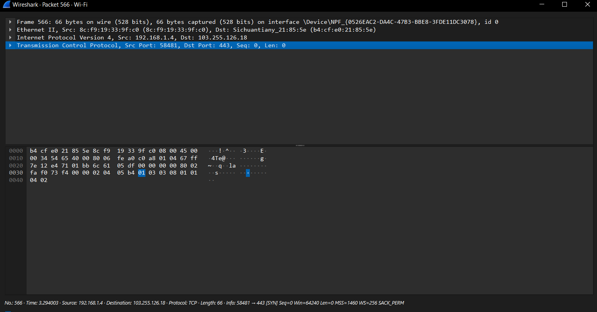
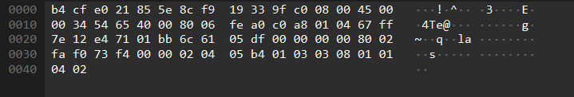
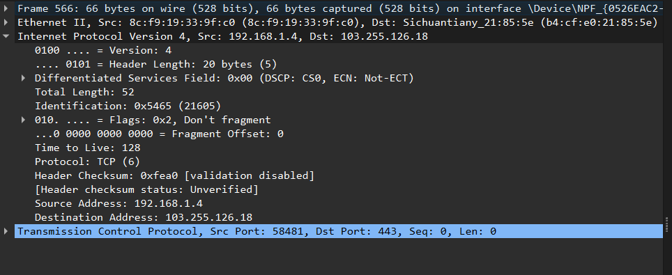
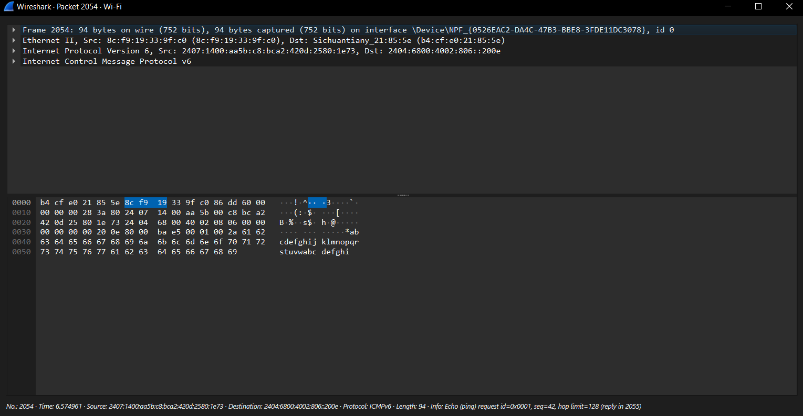
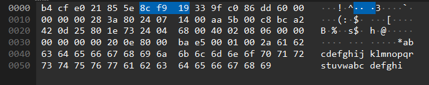
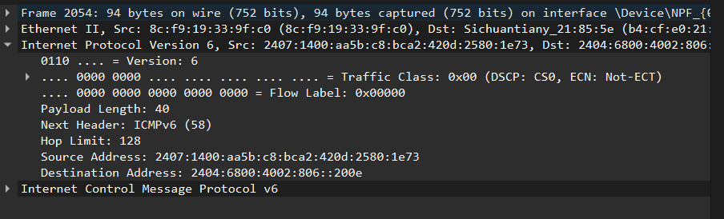

## Tasks:
```
1. Use Wireshark to demonstrate different packets involved in getting IP address from a DHCP server.
2. On Wireshark, capture an IP packet. Write the value of each field on the header and explain how those values are calculated.
3. Filter a Wireshark capture on IPV6 and explain why its field has the value it does.
4. In the preferred language of your choice, write a web application that allows you to upload a file of minimum 10 MB size. Capture the upload in Wireshark. In your Wireshark capture, follow the TCP stream to inspect connection initiation, file transfer and connection termination.
```

## 1. Use Wireshark to demonstrate different packets involved in getting IP address from a DHCP server.

1. Start capturing packets with Wireshark.
2. Open the command prompt and release the IP Address with the command:
    ```
    ipconfig /release
    ```
3. Request a new IP Address with the command:
    ```
    ipconfig /renew
    ```
4. Now stop capturing packets in Wireshark.
5. Filter out the DHCP packets.


Here's a brief explaination of each of the DHCP packets discovered:

1. **DHCP**: The client releases its current IP address back to the DHCP server. This can happen when a client shuts down or manually releases the IP address.
2. **DHCP Discover**: The client broadcasts a discover message to locate any available DHCP servers on the network.
3. **DHCP Offer**: The DHCP server responds to the discover message with an offer that includes an available IP address and other network configuration details.
4. **DHCP Request**: The client responds to the server's offer by requesting the offered IP address. The broadcast ensures that all servers know which offer was accepted.
5. **DHCP Acknowledgement**: The DHCP server confirms that the client can use the requested IP address, completing the DHCP lease process.

## 2. On Wireshark, capture an IP packet. Write the value of each field on the header and explain how those values are calculated.

1. Start capturing packets with Wireshark.
2. To focus on IP packets, you can set a filter like ip in the filter bar.
3. You can generate some traffic, such as by opening a web page or pinging a remote host.
4. Once you've captured enough packets, stop the capture.
5. Look through the captured packets for one that shows "IP" under the protocol column.
6. Click on the packet to view its details. Expand the "Internet Protocol Version 4" section to see the fields of the IP header.

Packet Capture:


Hexadecimal Data:


IP Header:


Here's a brief explanation for each of the fields in IP Header:

1. **Version (4 bits)**: This field indicates the version of the IP protocol. In IPv4, the value is always 4.
2. **Header Length (4 bits)**: This field tells the length of the IP header in 32-bit words. The minimum length is 20 bytes (5 words), so the typical value is 5.
3. **Type of Service (8 bits)**: This field is used for quality of service (QoS) to prioritize packets. The value depends on how the packet is marked (e.g., for low delay, high throughput).
4. **Total Length (16 bits)**: This field specifies the entire packet size, including header and data, in bytes. It's calculated by adding the length of the IP header and the length of the data payload.
5. **Identification (16 bits)**: This field is used to identify fragments of the original IP packet. If a packet is fragmented, all fragments will have the same identification value.
6. **Flags (3 bits)**: These bits are used for controlling or identifying fragments. The common flags are: DF (Don't Fragment) and MF (More Fragments).
7. **Fragment Offset (13 bits)**: This field indicates where in the original datagram this fragment belongs. If the packet isn't fragmented, this value is 0.
8. **Time to Live (TTL) (8 bits)**: This field indicates how many hops (routers) the packet can pass through before being discarded. It’s decremented by 1 by each router that handles the packet. The initial value is set by the operating system (e.g., 64 for Linux, 128 for Windows).
9. **Protocol (8 bits)**: This field indicates the protocol used in the data portion of the IP packet. Common values include: `6` for TCP and `17` for UDP.
10. **Header Checksum (16 bits)**: This field is used for error-checking the IP header. It’s calculated by summing the contents of the IP header, dividing into 16-bit words, and then taking the one's complement of the sum.
11. **Source IP Address (32 bits)**: This field contains the IP address of the source host.
12. **Destination IP Address (32 bits)**: This field contains the IP address of the destination host.

## 3. Filter a Wireshark capture on IPV6 and explain why its field has the value it does.

1. Start capturing, then stop once you've gathered enough packets.
2. Generate IPv6 traffic by visiting a website that supports IPv6 or by pinging an IPv6 address. You can use the following command:
    ```
    ping -6 ipv6.google.com
    ```
3. Start capturing, then stop once you've gathered enough packets.
4. Filter out the IPv6 packets with `icmpv6` in the filter.

Packet Capture:


Hexadecimal Data:


IP Header:


Here's a brief explanation on the several fields in a IPv6 Header:

1. **Version (4 bits)**: This field indicates the version of the IP protocol, and in the case of IPv6, the value is always 6.
2. **Traffic Class (8 bits)**: This field is used for QoS (Quality of Service). It’s similar to the Type of Service (ToS) field in IPv4. It can be set by the sender to specify a priority for the packet.
3. **Flow Label (20 bits)**: The flow label is used by a source to label sequences of packets that require special handling by the IPv6 routers, such as non-default quality of service or "real-time" service.
4. **Payload Length (16 bits)**: This field specifies the length of the IPv6 payload, i.e., the size of the data following the header. This includes the size of any extension headers.
5. **Next Header (8 bits)**: This field identifies the type of header immediately following the IPv6 header. It’s similar to the Protocol field in IPv4. Common values include: `6` for TCP, `17` for UDP and `58` for ICMPv6.
6. **Hop Limit (8 bits)**: This field specifies the maximum number of hops (routers) that the packet can pass through before being discarded. Each router decreases the hop limit by one. It’s analogous to the Time to Live (TTL) field in IPv4.
7. **Source Address (128 bits)**: This field contains the IPv6 address of the device sending the packet.
8. **Destination Address (128 bits)**: This field contains the IPv6 address of the device intended to receive the packet.

## 4. In the preferred language of your choice, write a web application that allows you to upload a file of minimum 10 MB size. Capture the upload in Wireshark. In your Wireshark capture, follow the TCP stream to inspect connection initiation, file transfer and connection termination.