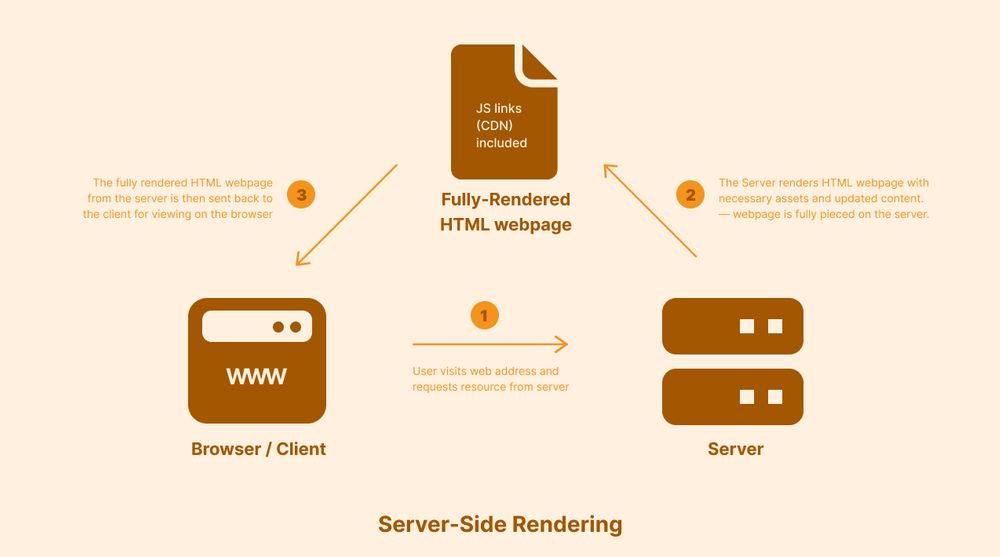
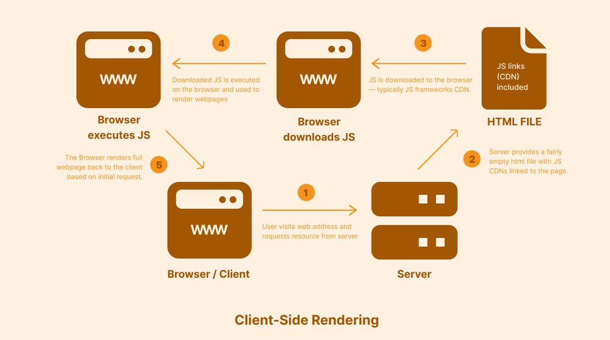
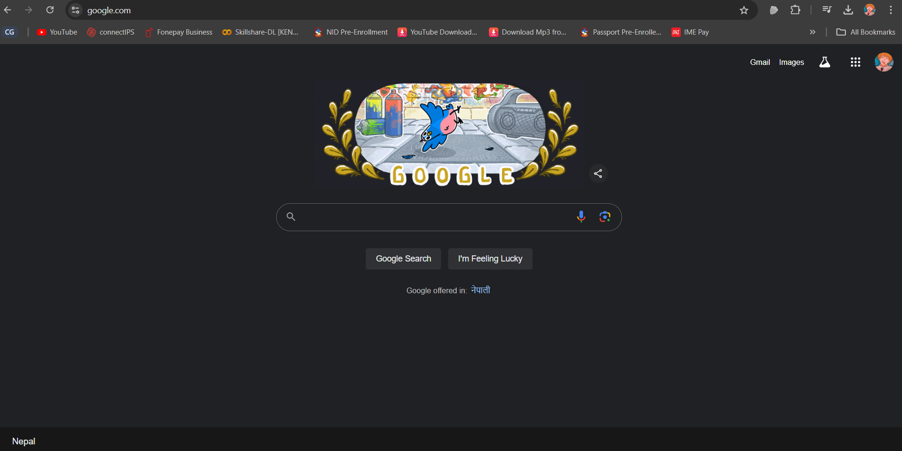

## Task:
```
1. What happens when you type google.com on the browser and press enter? Write a report.
```
## 1. What happens when you type google.com on the browser and press enter?


When you type "google.com" into your browser and press Enter, a complex series of events occurs behind the scenes to load the Google homepage. Here's a step-by-step breakdown of the process:
1. **URL Parsing**:

    The browser begins by parsing the URL "google.com" to understand the protocol (HTTP/HTTPS), the domain name (google.com), and potentially any path or query string. This parsing helps the browser determine how to handle the request and what steps to follow next.

2. **DNS Lookup**:

    

    The browser needs to find the IP address associated with "google.com." It sends a DNS query to resolve the domain name into an IP address.

    Steps Involved:
   
    - Checks if the IP address is cached from a previous visit.
    - If not found in the browser, it checks the OS-level DNS cache.
    - If still unresolved, the request moves to the router's cache.
    - If the router doesn't have the address, it queries the ISP's DNS server.
    - If the ISP's server doesn't have the address, it begins a recursive search through the root DNS servers, TLD (Top-Level Domain) servers (.com), and authoritative DNS servers until it finds the IP address for "google.com."

4. **TCP/IP Connection**:

    

    Once the IP address is obtained, the browser initiates a TCP connection to the server using the IP address.

    Steps Involved:

    - **3-Way Handshake**: The browser and the server perform a TCP 3-way handshake to establish a reliable connection.
    - **SYN**: The browser sends a SYN (synchronize) packet to the server.
    - **SYN-ACK**: The server responds with a SYN-ACK (synchronize-acknowledge) packet.
    - **ACK**: The browser sends an ACK (acknowledge) packet back, and the connection is established.

5. **SSL/TLS Handshake (if HTTPS)**:

    If the URL is "https://google.com," the browser initiates an SSL/TLS handshake to establish a secure connection.

    Steps Involved:

    - The browser requests the server's SSL/TLS certificate.
    - The server responds with its certificate, including the public key.
    - The browser verifies the certificate against trusted Certificate Authorities (CAs).
    - A session key is created, encrypted with the server's public key, and sent back to the server.
    - Both the browser and the server now have a secure, encrypted connection.

6. **HTTP Request**:

    With the connection established, the browser sends an HTTP GET request to the server for the content of "google.com."

    Components of the Request:

    - **Request Line**: Specifies the HTTP method (GET), the resource ("/"), and the HTTP version.
    - **Headers**: Includes information like the browser type (User-Agent), acceptable content types, cookies, and more.
    - **Body**: Often empty in a GET request.

7. **Server Processing**:

    

    The server receives the HTTP request, processes it, and determines how to respond.

    Steps Involved:

    - **Routing**: The server checks its routing to identify the requested resource (in this case, the homepage).
    - **Fetching Data**: If necessary, the server queries databases or performs other back-end processing.
    - **Generating Response**: The server constructs the HTTP response, including status code, headers, and the HTML content.

8. **HTTP Response**:

    The server sends back an HTTP response containing the requested content.

    Components of the Response:

    - **Status Line**: Includes the HTTP version, status code (e.g., 200 OK), and a reason phrase.
    - **Headers**: Contains metadata like content type, content length, cookies, etc.
    - **Body**: Contains the actual HTML, CSS, JavaScript, and other resources needed to render the page.

9. **Rendering the Page**:

    

    The browser receives the HTTP response and begins rendering the page.

    Steps Involved:

    - **HTML Parsing**: The browser parses the HTML to create a Document Object Model (DOM) tree.
    - **CSS Parsing**: The browser parses CSS files to apply styling to the DOM elements.
    - **JavaScript Execution**: If any JavaScript files are included, the browser executes them, potentially modifying the DOM or performing other tasks.
    - **Rendering**: The browser renders the page visually, combining the DOM with CSS and JavaScript to display the webpage.

10. **Resource Loading**:

    As the HTML is parsed, the browser may encounter additional resources like images, CSS files, and JavaScript files that need to be loaded.

    Steps Involved:

    - **HTTP Requests for Resources**: The browser sends additional HTTP requests for each of these resources.
    - **Resource Caching**: The browser checks if any of these resources are cached; if not, it fetches them from the server.
    - **Rendering Updates**: As these resources load, the browser updates the rendering of the page.

11. **Final Page Display**:

    

    Once all resources are loaded and processed, the final rendered page is displayed to the user. The user can now interact with the page, and any further actions (like clicking a link) will repeat parts of this process.

In summary, when you type "google.com" and press Enter, your browser performs a series of steps including DNS resolution, establishing a TCP connection, possibly performing an SSL handshake, sending an HTTP request, processing the server's response, and rendering the final webpage. Each of these steps involves multiple sub-processes that work together to display the content you requested in just a few seconds.
