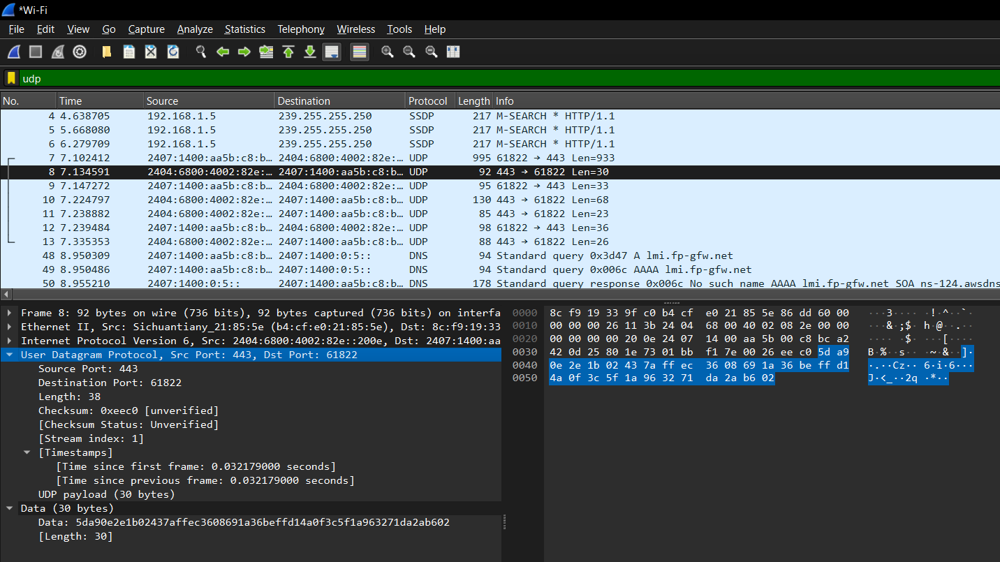
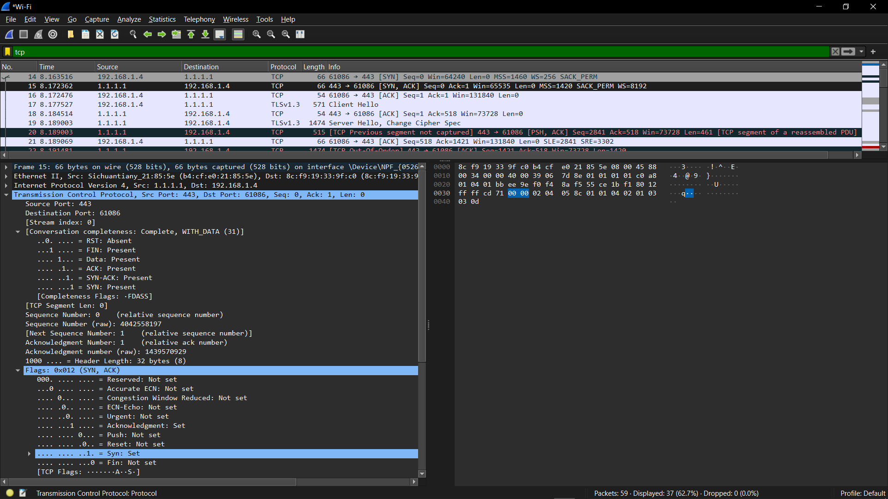
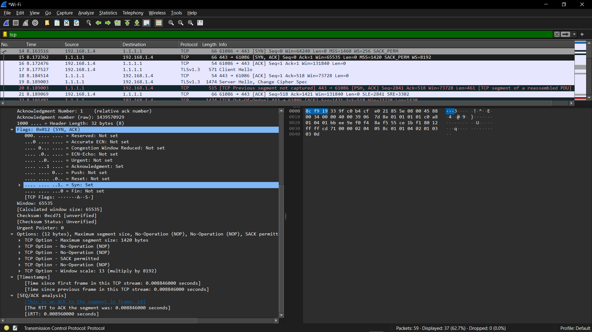

## Tasks:
```
1. How many bytes is UDP header? What are the different fields. How are the field values set?
2. How many bytes is TCP header? What are the different fields. How are the field values set?
3. Verify in Wireshark.
```

# 1. How many bytes is UDP header? What are the different fields. How are the field values set?

The UDP (User Datagram Protocol) header is 8 bytes long.

The different UDP Header Fields with their brief explanation are as follows:

1. **Source Port (16 bits)**:

    It identifies the port number of the sending application. It can be set by the application to any valid port number.

2. **Destination Port (16 bits)**:

    It identifies the port number of the receiving application. This value is set based on the application or service that is being communicated with.

3. **Length (16 bits):**:

    It specifies the total length of the UDP header and data in bytes. The minimum value is 8 bytes, corresponding to the length of the UDP header with no data. The length is calculated as `8 + data length`.

4. **Checksum (16 bits)**:

    It is used for error-checking the header and data. This field is optional in IPv4 but mandatory in IPv6. If the checksum is not used, this field is set to zero. Otherwise, it's calculated using a pseudo-header (which includes parts of the IP header) and the UDP header and data.

# 2. How many bytes is TCP header? What are the different fields. How are the field values set?

The TCP (Transmission Control Protocol) header has a minimum size of 20 bytes. However, it can be larger if options are used, with the maximum size being 60 bytes.

The different TCP Header Fields with their brief explanation are as follows:

1. **Source Port (16 bits)**:

    It identifies the port number of the sending application. It can be set by the application to any valid port number.

2. **Destination Port (16 bits)**:

    It identifies the port number of the receiving application. This value is set based on the application or service that is being communicated with.

3. **Sequence Number (32 bits)**:

    The sequence number of the first byte in the segment. It is set by the sender to keep track of the data being sent

4. **Acknowledgement Number (32 bits)**:

    The next sequence number that the sender of the segment is expecting to receive. This is set by the receiver to acknowledge the receipt of data.

5. **Data Offset (4 bits)**:

    Also known as the header length, it indicates the size of the TCP header in 32-bit words. It is set based on the length of the TCP header, including any options.

6. **Reserved (3 bits)**:

    Reserved for future use and set to zero

7. **Flags (9 bits)**:

    Control flags like URG, ACK, PSH, RST, SYN, FIN which indicate specific control information. Flags are set according to the control information (e.g., SYN for establishing a connection).

8. **Window Size (16 bits)**:

    Specifies the size of the sender's receive window (i.e., how much data the sender is willing to receive). Window Size is determined by the buffer space available at the receiver.

9. **Checksum (16 bits)**:

    Used for error-checking the header and data. It is calculated similarly to the UDP checksum, using a pseudo-header. Checksum is computed using the TCP payload, the pseudo-header, and the TCP header.

10. **Urgent Pointer (16 bits)**:

    If the URG flag is set, this field indicates the offset from the sequence number to the last urgent byte. Urgent Pointer is set if the URG flag is used.

11. **Options (variable length)**:

    May include options for maximum segment size, window scaling, timestamps, etc. The length is variable, and this field is optional. Options are set if any specific TCP options are required.

# 3. Verify in Wireshark.

## 1. Wireshark for UDP



## 2. Wireshark for TCP


