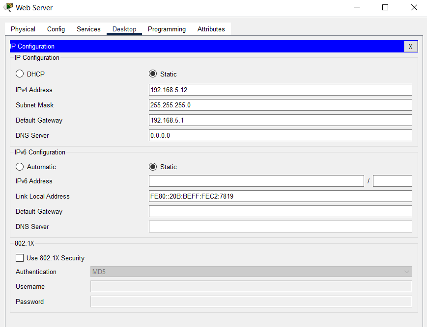
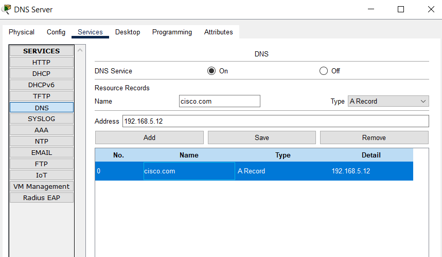
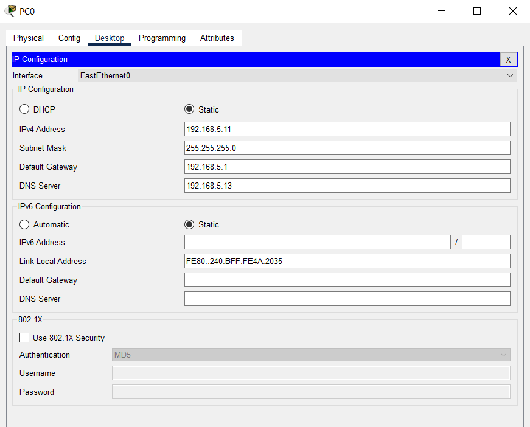

## Tasks
```
1. What is Private IP Address?
2. What is Public IP Address?
3. How do the two work together to solve the problem of non-enough IP addresses?
4. What are the private IPS?
5. Simulate a DNS Server and Web Server in packet server.
```

# 1. What is Private IP Address?

A Private IP Address is an IP address that is used within a private network, such as a home, school, or business. These addresses are not routable on the public internet, meaning they are reserved for use within the local network only. Examples of private IP address ranges include `192.168.0.0/16`, `172.16.0.0/12`, and `10.0.0.0/8`.

# 2. What is Public IP Address?

A Public IP Address is an IP address that is unique and routable over the internet. Assigned by ISPs, these addresses allow devices to communicate with external networks and are necessary for internet access. Each device or network that needs to communicate externally must have a unique public IP address.

# 3. How do the two work together to solve the problem of non-enough IP addresses?

Private and Public IP addresses work together through a process called Network Address Translation (NAT). NAT allows multiple devices on a private network to share a single public IP address to access the internet. This effectively conserves the number of public IP addresses needed, solving the problem of IPv4 address exhaustion by allowing many devices to function behind a single public IP.

# 4. What are the private IPS?

Private IP addresses (IPS) are essential for managing internal network communication without consuming global IP resources. By keeping internal traffic within a private IP range, they reduce the demand for public IP addresses, while NAT handles the translation to a public IP for internet access, ensuring efficient IP utilization.

# 5. Simulate a DNS Server and Web Server in packet server.


Web Server Settings:




DNS Server Settings:




PC settings:



Web Browser:

