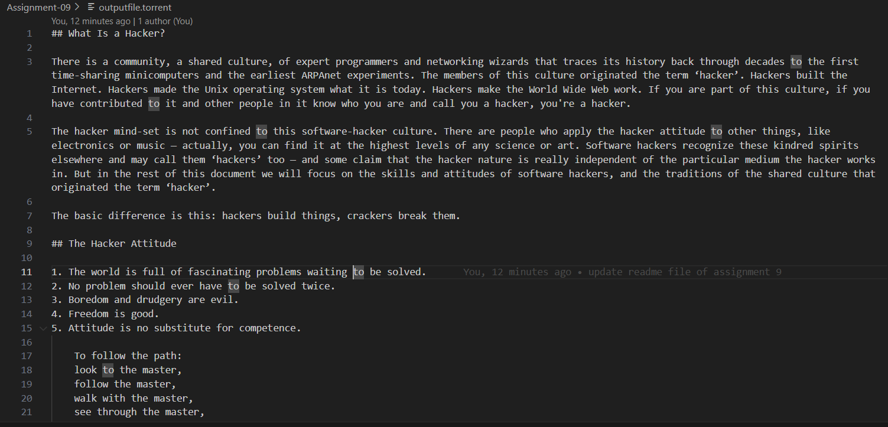
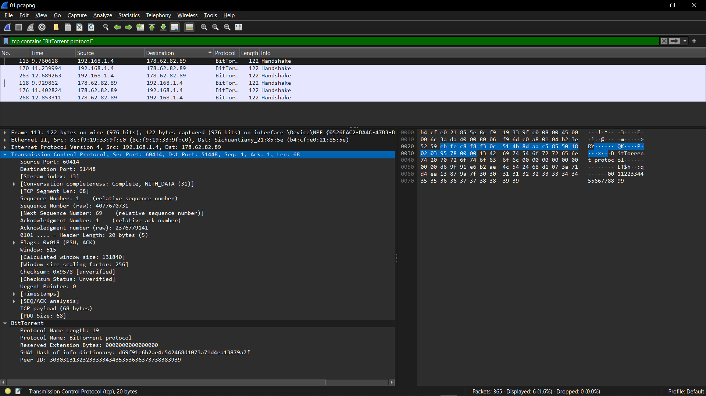

## Tasks:
```
1. Build your own BitTorrent Client.
```

# 1. Build your own BitTorrent Client.

We have followed the steps from codecrafter.com and created our own BitTorrent. The code files are attached herewith.

A brief breakdown of our code is as follows:

1. Import Statements:

    `import json, sys, socket, hashlib, requests, struct, os`:` These modules provide necessary functionality:

    - `json`: For encoding/decoding JSON data.
    - `sys`: For handling command-line arguments.
    - `socket`: For network communication.
    - `hashlib`: For generating hash values (e.g., SHA1).
    - `requests`: For making HTTP requests (used for tracker communication).
    - `struct`: For packing/unpacking binary data.
    - `os`: For file system interactions (e.g., file removal).

2. Bencoding and Decoding FunctionS:

    - `decode_string, decode_int, decode_list, decode_dict, decode_bencode`: These functions decode data encoded in the Bencode format, which is used in `.torrent` files to represent strings, integers, lists, and dictionaries.
    - `bencode_string, bencode_bytes, bencode_int, bencode_list, bencode_dict, bencode`: These are the counterpart functions for encoding data into the Bencode format.

3. Torrent File Handling:

    - `decode_torrentfile(filename)`: This function reads a `.torrent file` and decodes its content into a Python dictionary.
    - `piece_hashes(pieces)`: This function splits a long string of piece hashes into individual 20-byte SHA1 hashes.

4. Torrent Information Display:

    - `print_info(filename)`: Prints key information from a torrent file, such as tracker URL, file length, piece length, and piece hashes.

5. Peer Communication:

    - `get_peers(filename)`: Contacts the tracker specified in the torrent file to get a list of peers (other users sharing the file).
    - `split_peers(peers)`: Decodes the compact peer list into a more readable IP format.
    - `init_handshake(filename, peer)`: Initiates a handshake with a peer, a crucial first step in establishing a connection.
    - `construct_message(message_id, payload)`: Creates a properly formatted message to send to a peer, including message length and ID.
    - `verify_message(message, message_id)`: Ensures that the received message has the expected format and message ID.
    - `receive_message(s)`: Reads a message from a socket, handling incomplete transmissions.

6. Downloading Pieces:

    - `request_block(s, piece_index, block_index, length)`: Requests a specific block (part of a piece) from a peer.
    - `download_piece(outputfile, filename, piececount)`: Downloads a specific piece from a peer, verifies its integrity using SHA1 hash, and saves it to disk.

7. Main Download Function:

    - `download(outputfile, filename)`: Manages the full download process by sequentially downloading all pieces of the file, combining them, and saving the result.

8. Helper Functions:

    - `bytes_to_str(data)`: Converts byte strings into regular strings for easier JSON serialization.

9. Command-Line Interface (CLI):

    - `main()`: The main function that interpret command-line arguments to execute specific commands (decode, info, peers, handshake, download_piece, download), making the script usable as a command-line tool.

10. Execution Entry Point:

    - `if __name__ == "__main__": main()`: Ensures that the main() function is executed when the script is run directly.

# Capturing Packets 

1. Start Capturing Packets in Wireshark.
2. Run this command in your terminal to download the torrent file:
    ```
    python main.py download -o outputfile.torrent sample.torrent
    ```
3. Stop Capturing Packets.
4. Filter the handshake message using the argument: `tcp contains "BitTorrent protocol"`
5. Save and Exit.

Downloaded Torrent file:



Packets Captured:



